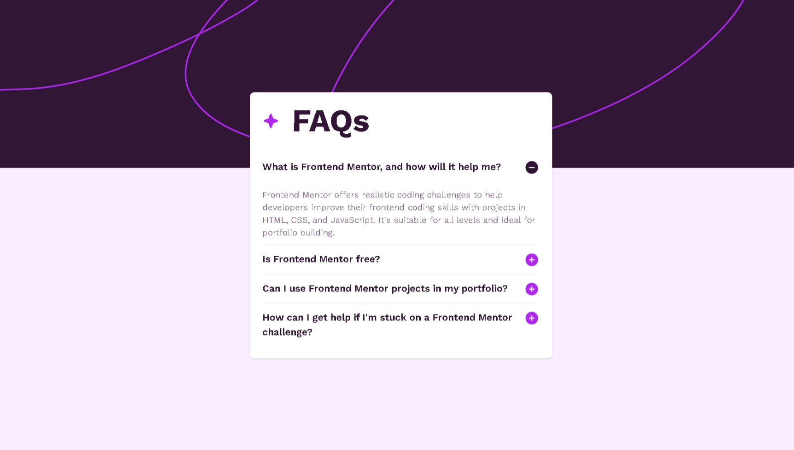

# Frontend Mentor - FAQ Accordion Solution

This is a solution to the [FAQ accordion challenge on Frontend Mentor](https://www.frontendmentor.io/challenges/faq-accordion-wyfFdeBwBz). Frontend Mentor challenges help you improve your coding skills by building realistic projects.

## Table of contents

- [Frontend Mentor - FAQ Accordion Solution](#frontend-mentor---faq-accordion-solution)
  - [Table of contents](#table-of-contents)
  - [Overview](#overview)
    - [The challenge](#the-challenge)
    - [Screenshot](#screenshot)
    - [Links](#links)
  - [My process](#my-process)
    - [Built with](#built-with)
    - [What I learned](#what-i-learned)
    - [Continued development](#continued-development)
    - [Useful resources](#useful-resources)
  - [Author](#author)

## Overview

### The challenge

Users should be able to:

- Hide/Show the answer to a question when the question is clicked
- Navigate the questions and hide/show answers using keyboard navigation alone
- View the optimal layout for the interface depending on their device's screen size
- See hover and focus states for all interactive elements on the page

### Screenshot



### Links

- Solution URL: [View solution on Frontend Mentor](https://www.frontendmentor.io/solutions/faq-accordion-TRiy1YjoIE)
- Live Site URL: [View live site](https://faq-accordion-tau-flame.vercel.app/)

## My process

### Built with

- Semantic HTML5 markup
- CSS custom properties
- Flexbox
- Mobile-first workflow
- Vanilla JavaScript

### What I learned

Working through this project helped reinforce my understanding of DOM manipulation and event delegation in JavaScript. I also practiced using semantic HTML and improved my approach to building responsive components using mobile-first design.

```js
accordionBtns[i].addEventListener('click', function () {
  this.classList.toggle('active');
  const accordionContent = this.nextElementSibling;
  accordionContent.classList.toggle('active');
});
```

### Continued development

In future projects, I want to improve on accessibility, particularly using ARIA attributes and roles to enhance the experience for users relying on assistive technologies. I also plan to refactor similar components using frameworks like React to streamline state management.

### Useful resources

- [MDN Web Docs](https://developer.mozilla.org/) – My go-to for JavaScript and CSS documentation.
- [CSS Tricks - Accordion Article](https://css-tricks.com/how-to-create-an-animated-accordion-using-css-and-javascript/) – Helped with understanding accordion animations and accessibility.
- [The Markdown Guide](https://www.markdownguide.org/) – Great resource for formatting README files like this one.

## Author

- Website – [iwaola.me](https://iwaola.me)
- Frontend Mentor – [@fawaziwalewa](https://www.frontendmentor.io/profile/fawaziwalewa)
- Twitter – [@IwalewaFawaz](https://twitter.com/IwalewaFawaz)
